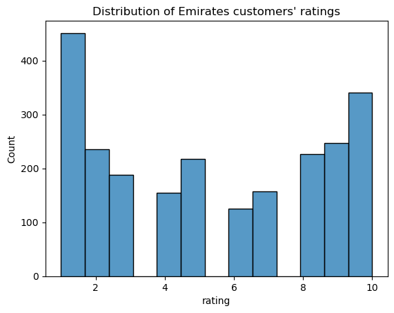
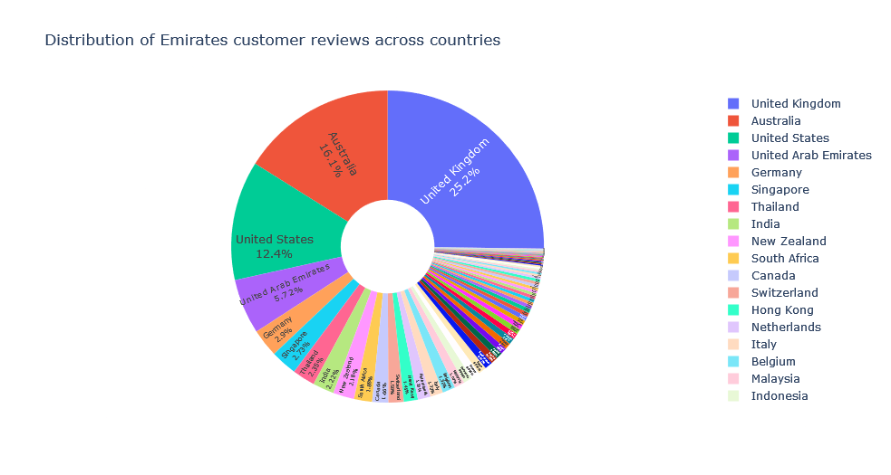
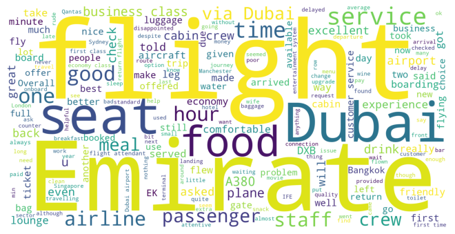
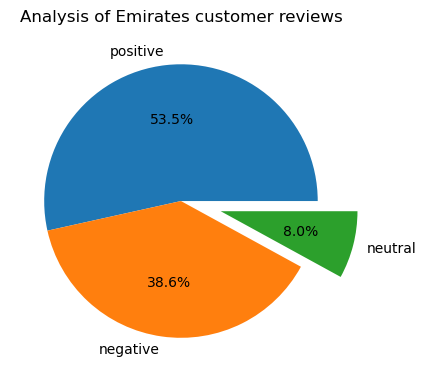

# Analysis of Emirates customer reviews

**Objective:** Understand how customers feel about the Emirates brand.

**Tasks:**
1. Scrape and collect customer feedback from the third-party website.
2. Conduct EDA and data cleaning.
3. Generate a word cloud from customer reviews.
4. Perform sentiment analysis.

**Results:**
* The collected data includes 2345 Emirates customer reviews and covers the period from December 2013 to March 2024.
* A 1-star rating out of 10 is prevalent in the reviews.
<!--  -->

* Top-5 countries of review origin: UK, Australia, US, UAE, and Germany.
<!--  -->

* The frequency word cloud below shows that the key topics within the reviews include **service**, **seat**, **food**, and **staff**, showing that people are actively talking about their experience and staff.
<!--  -->

* Out of 2345 reviews, 1254 were positive, 904 were negative and 187 were neutral. This means the majority of reviews were polarised as either positive or negative.
<!--  -->

**Libraries employed:**

`pandas` `requests` `beautifulsoup` `seaborn` `matplotlib` `plotly` `wordcloud` `nltk` `tqdm`
